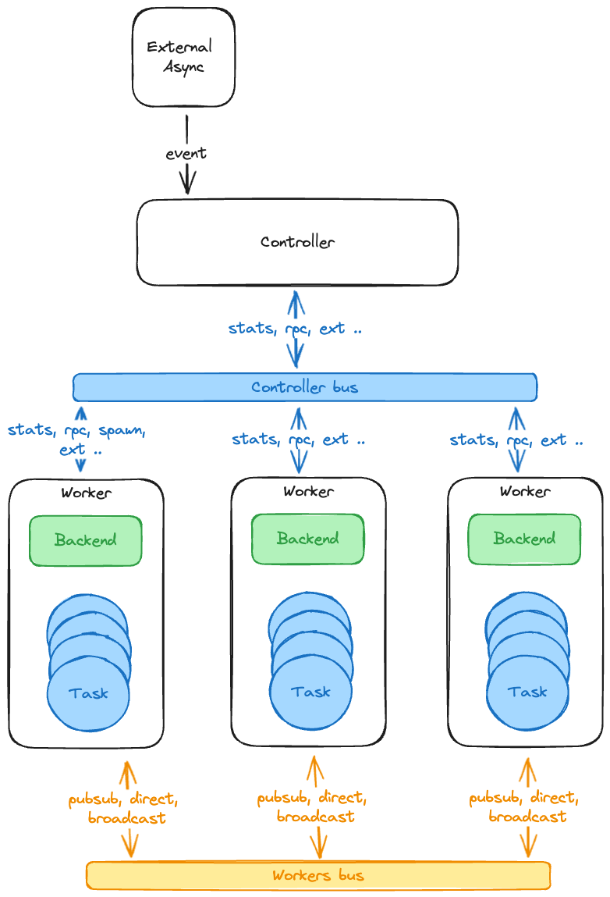

# SansIo runtime (Working in progress)

(This module is in very early stage of development. It is not ready for production use.)

This is a simple, lightweight, and fast runtime for the SansIo mechanism.

## Goal

The goal of this project is to provide a simple, lightweight, and fast runtime for the SansIo mechanism. The runtime should be able to run on any platform with variables network library like: mio, io_uring, af_xdp.

## How it works

Controller will spawn some threads and each thread will run a worker. The workers

## Features

| Impl | C/I | Works | Benchmark | Group   | Description                        |
| ---- | --- | ----- | --------- | ------- | ---------------------------------- |
| [x]  | [ ] | [x]   | [ ]       | Control | Cross tasks communication          |
| [x]  | [ ] | [x]   | [ ]       | Control | Controller to worker communication |
| [ ]  | [ ] | [ ]   | [ ]       | Control | Controller to task communication   |
| [x]  | [ ] | [x]   | [ ]       | Control | Workers status monitoring          |
| [x]  | [ ] | [x]   | [ ]       | I/O     | Udp                                |
| [ ]  | [ ] | [ ]   | [ ]       | I/O     | Tcp                                |
| [ ]  | [ ] | [ ]   | [ ]       | I/O     | Rpc                                |
| [x]  | [ ] | [x]   | [ ]       | Backend | mio                                |
| [ ]  | [ ] | [ ]   | [ ]       | Backend | io_uring                           |
| [ ]  | [ ] | [ ]   | [ ]       | Backend | af_xdp                             |
| [x]  | [ ] | [x]   | [ ]       | Example | Udp echo server                    |
| [x]  | [ ] | [x]   | [ ]       | Example | Udp echo client                    |
| [x]  | [ ] | [x]   | [ ]       | Example | Simple Whip/Whep server            |

## Design

